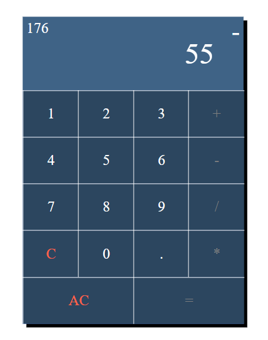

# Calculator
Calculator implementation in javascript

Demo Link: https://binish784.github.io/Calculator/

Features:
1. both mouse + keyboard inputs
2. divide by  0 detection
3. decimal support
4. nice design

